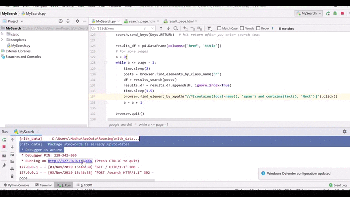

# Ceegle-search
Finding the google search results which shows conspiracy content - NLP, Webscrapper, Flask app

### Objective: Highlight the conspiracy content on the google search.

### Steps:
1) Using webscrapper extracting title and url from 4 pages of google search.
2) Extracting information from twitter for the search key with #conspiracy.[Positive labels]
3) Extracting information from twitter for the search key.[Negative labels]
4) The above will be used as the training set.
5) The extracted text then has to be cleaned. It is a part of NLP
    - Removing symbols, single characters, numbers, etc.,
    - Removing stop words
    - POS(Part-of-speech) tagger is used and extracted "noun, verb, adjective" that are relative. 
    - Lemmatizing based on POS(P)(eg: going, go => go)
    - There will always be more unwanted words that appear rarely. So based on frequency top 30 words from both positive and negative words are choosen.
    - The others words were removed.
    - This is converted to TFIDF(Term frequency Inverse Document Frequency) vectorizor.
6) This was converted into a dataframe. To ascess the frequency of each words.
7) Using KNN(k-nearest neighbor) Algorithm the classification algorithm was implemented from scratch. The distance metric used is euclidean distance with k=7.Compared to Random forest algorithm this seemed to work well for the prediction.
8) From the google search results, all the cleaning process done for the trainig set has been repeated.
9) Then the KNN algorithm was used to test the classification results. The application was converted into the gif file for easy understanding.

### The below is the preview of the application with search key = "pope". This will identify conspiracy content on the google search. 

